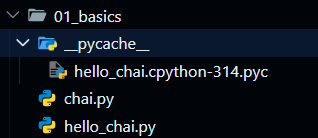

# Install Python

You can download Python in your machine from [official Python website](https://www.python.org). After it is downloaded, just install it into your machine.

## Check your version.

1. Open your terminal (**Git Bash** preferred for Windows).
2. Use this command to check the version of Python in your machine:

```bash
python --version
```

You will get an output like:

```
Python 3.14.0
```

> **Note:** In Windows, we use `python`. In Mac or Linux, we use `python3`.

Python is **highly stable** and **reliable**. Python maintains strong **backward compatibility**, meaning code written for older Python 3 versions generally runs on newer releases without breaking.

A major transition in the language's history was the **Python 2 to Python 3 migration**. Python 3 deliberately broke backward compatibility to fix fundamental design flaws.

## Write a program

1. Open **VS Code**.
2. Create a folder `01_basics`.
3. Inside the folder, create a file `hello_chai.py`.
4. Write a program:

```python
print("chai aur python")
```

5. Open your terminal inside VS Code. (**Git Bash** preferred.)
6. Enter this command to run the Python code:

```bash
python 01_basics/hello_chai.py
```

This will give the following output in yur terminal:

```
chai aur python
```

## Some random stuff

Inside `hello_chai.py` file, write some more code as:

```python
print("chai aur python")

def chai(n):
    print(n)

chai("lemon tea")
```

Run this program:

```bash
python 01_basics/hello_chai.py
```

You will get the following output:

```
chai aur python
lemon tea
```

Now, create a file `chai.py` inside `01_basics` folder. Write the following code:

```python
from hello_chai import chai

chai("ginger tea")
```

Run this program:

```bash
python 01_basics/chai.py
```

You will get the following output:

```
chai aur python
lemon tea
ginger tea
```

Along with the output, you get another folder inside `01_basics` folder named `__pycache__`. Inside this folder, there is a file named `hello_chai.cpython-314.pyc`.

